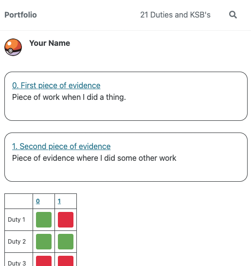
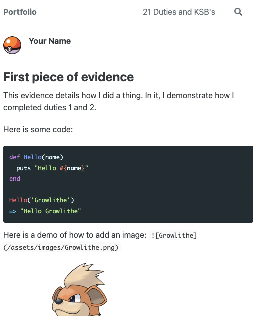

# Portfolio Showcase

I have created this to be an option when deciding how to create, update and display your portfolio for the Level 4 Software Developer Apprenticeship Apprenticeship course.

It is a modified and preconfigured [Jekyll](https://jekyllrb.com/) / [Minimal Mistakes](https://mmistakes.github.io/minimal-mistakes/) setup.
This mean's that any customisation that you can do to them, you can can also do to this if you want to personalise it and make it more your own.

## Copying this template
You can use this template by clicking the `Use this template` button at the top of the repo.
This will allow you to select yourself at the owner and give it a name.

## Running it locally, and checking it works
To get it running all you need to do it is:
1. Pull down the newly create repo
2. Run these commands:
```ruby
bundle
bundle exec jekyll serve
```
It will then be available to view at `http://127.0.0.1:4000/`

### Homescreen


### Evidence


The app is a static file app. This means, when you run the jekyll command, it will convert your files in to static html / css files.
You are able to just run the server locally, or you can host these file on your own webserver, or using something like Netlify. (Just be aware, due to the nature of the evidence, it will likely contain code snippets that your company will not want made public. So make sure you have some kind of security set up so its not open to the world.)

***

## Adding to your Portfolio
When writing evidence for your portfolio, you can create a new file in `_portfolio/`. The ordering on the home screen and using the next / previous buttons work based on the names on the files, so if you want a specific order, start the file names with numbers.

Images should be stored in assets/images then can be used in portfolio pieces. In the top section of your portfolio evidence (the frontmatter), you can add the list of duties achieved with that piece of evidence. It is this data that powers the table on the front page.

You can also add the title and the summary here, this again populates the home screen and the title is used on the page itself.

My recommendation would be, when writing evidence, create a new branch, write the evidence, then you can get review and feedback from your manager / mentor / buddy / team mates / each other (anyone really).

Once everyone, and mainly you, are happy, you can merge the evidence and deploy it to your chosen hosting platform.

***

## Updating the CHANGE-ME's

Within `_config.yml` you need to change `CHANGE-ME` to your name.

Within `/assets/images/` there is a `profile-pic.png` file. You can replace this with your own image.
